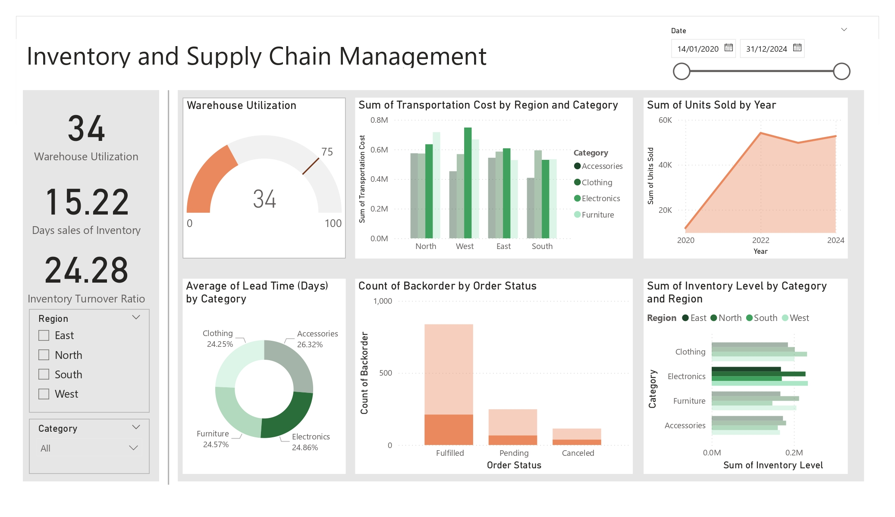

# Welcome to my portfolio! 

Here, you’ll find projects that showcase my expertise in data cleaning, analysis, and visualization. Through these projects, I demonstrate my ability to transform raw data into actionable insights that drive informed, data-driven decision-making across diverse industries.

## Project 1: Startup Business Sales Analysis & Inventory Management Dashboard

Developed a dynamic, cloud-based dashboard for a startup (simulated) to analyze sales trends, optimize inventory management, and monitor staff costs. Created a relational database and integrated it with SQL and visualization tools to transform raw data into actionable insights.

The solution features interactive dashboards covering:

- Sales Activity: total orders, total sales, total items, average order value, top-selling items, sales by hour, orders by location, delivery vs. pickup analysis
- Inventory Management: ingredient stock levels, total and per-item ingredient costs, calculated cost per product, percentage of stock remaining
- Staff Monitoring: total staff costs, total hours worked by staff member, cost per staff member

**Tools:** SQL, Looker Studio, Google Cloud Platform (Cloud SQL for MySQL, Cloud Storage buckets, Compute instances)

**Skills:** Database design and creation, cloud database migration, data integration and automation and data visualization and dashboard development

| Relational database |  Dashboard |
|:--:|:--:|
|  |  |

[Show project](project_1/)

Link to the full dashboard: https://lookerstudio.google.com/reporting/4b0939ee-f091-4f9c-a76a-b3368a0e15ad

## Project 2: Inventory and Supply Chain Management Dashboard

Developed a dynamic, interactive dashboard for a simulated supply chain and inventory management scenario to monitor key logistics KPIs, optimize warehouse operations, and support strategic planning.

Insights: 

- Low Warehouse Utilization: Currently at 34%, well below the target 75%, indicating underused storage capacity.

- High Transportation Costs in the West: The West region incurs the highest logistics costs, especially for Clothing and Electronics.

- Sales Growth Slowing: After peaking in 2022, units sold have plateaued through 2023–2024, suggesting slowing demand.

- Backorder Volume Notable: Most backorders are fulfilled, but a significant number remain pending or canceled, pointing to supply chain inefficiencies.

**Tools:** Power BI, Python

**Skills:** Data modeling and relationship mapping for inventory systems, KPI development, Supply chain performance measurement and visualization.

|  Dashboard |
|:--:|
|   |

[Show project](project_2/)

